系统产品部 2024年3月11日培训资料

主题：AOSP和LineageOS编译、刷机和部分模块讲解

议程：

[<ins>1\. AOSP构建</ins>](# "#_AOSP%E9%83%A8%E5%88%86")

[<ins>2\. LineageOS构建</ins>](# "#_Build%20LineageOS%20for%20Xiaomi%20Mi%20MIX%202S")

[<ins>3.</ins> <ins>小米 Mix 2S刷机</ins>](# "#_%E5%88%B7%E6%9C%BA%E6%AD%A5%E9%AA%A4")

[<ins>4\. Linux&Android Input 子系统讲解</ins>](# "#_Android%20Input%E5%AD%90%E7%B3%BB%E7%BB%9F%E5%8F%82%E8%80%83%E6%96%87%E7%AB%A0")

[<ins>5\. OTA UpdateEngine讲解</ins>](# "#_Android%20UpdateEngine%E5%AD%90%E7%B3%BB%E7%BB%9F%E5%8F%82%E8%80%83%E8%B5%84%E6%96%99")

主讲：韩玮

参加：系统产品部智UI产品开发组

## **AOSP部分**

### **环境要求**

###### **硬件**

处理器：2.3.x以上Android版本需要64位架构的处理器

内存：官方最低16G，谷歌推荐64G；实测虚拟机32G以下内存有概率崩溃，物理机没问题，虚拟机建议至少40G内存

硬盘：代码250G，编译再加150G，建议500G以上SSD

网络：保证网络稳定，否则检出代码很容易中断

&nbsp;

参考：虚拟机+i5 10700 + 32G内存+SSD，检出代码约4小时，编译、链接、打包约3.5个小时

&nbsp;

###### **软件**

Ubuntu 22.04 LTS x64

JDK AOSP自带

Make AOSP自带

Python 3

sudo apt install git-core gnupg flex bison build-essential zip curl zlib1g-dev libc6-dev-i386 libncurses5 lib32ncurses5-dev x11proto-core-dev libx11-dev lib32z1-dev libgl1-mesa-dev libxml2-utils xsltproc unzip fontconfig

&nbsp;

以上都是针对Android9.0及以上版本的环境配置

&nbsp;

### **下载代码**

清华源：[<ins>https://mirrors.tuna.tsinghua.edu.cn/help/AOSP/</ins>](https://mirrors.tuna.tsinghua.edu.cn/help/AOSP/)

科大源：[<ins>https://mirrors.ustc.edu.cn/help/aosp.html</ins>](https://mirrors.ustc.edu.cn/help/aosp.html)

谷歌官方的方法不适合国内，参考

https://source.android.google.cn/docs/setup/download/downloading

&nbsp;

###### **方法一：**

以下是推荐的国内下载代码方法

**“**

初始同步方法

第一次同步数据量特别大，如果网络不稳定，中间失败就要从头再来了。所以我们提供了打包的 AOSP 镜像，为一个 tar 包，大约 200G（单文件 200G，注意你的磁盘格式要支持）。这样你 就可以通过 HTTP(S) 的方式下载，该方法支持断点续传。

下载地址 [<ins>https://mirrors.ustc.edu.cn/aosp-monthly/</ins>](https://mirrors.ustc.edu.cn/aosp-monthly/)

请注意对比 checksum。

然后根据下文 ***替换已有的AOSP源代码的remote*** 的方法更改同步地址。

解压后用命令 repo sync 就可以把代码都 checkout 出来。

Note: tar 包为定时从 https://mirrors.tuna.tsinghua.edu.cn/aosp-monthly/ 下载。

**”**

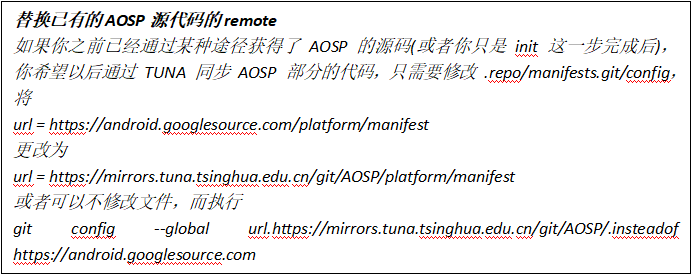

&nbsp;

###### **方法二：**

**“**

如果想用官方步骤+国内镜像地址的方法，将官方步骤中的 https://android.googlesource.com/ 全部使用 https://mirrors.tuna.tsinghua.edu.cn/git/AOSP/ 代替即可。由于使用 HTTPS 协议更安全，并且更便于我们灵活处理，所以强烈推荐使用 HTTPS 协议同步 AOSP 镜像。由于 AOSP 镜像造成CPU/内存负载过重，我们限制了并发数量，因此建议：sync的时候并发数不宜太高，否则会出现 503 错误，即-j后面的数字不能太大，建议选择4。请尽量选择流量较小时错峰同步。

**”**

&nbsp;

分支选择

参考：[<ins>https://source.android.google.cn/setup/start/build-numbers#source-code-tags-and-builds</ins>](https://source.android.google.cn/setup/start/build-numbers#source-code-tags-and-builds)

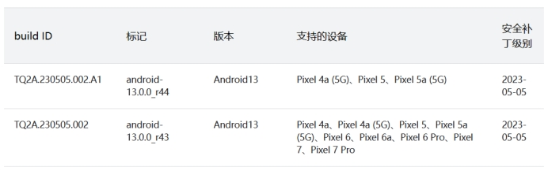 

是可用AOSP TAG

 

不是可用AOSP TAG，是补丁TAG

选择完REPO方式和TAG后，执行以下命令进行代码同步

repo init -u https://mirrors.tuna.tsinghua.edu.cn/git/AOSP/platform/manifest -b android-14.0.0_r1

repo sync

&nbsp;

&nbsp;

### **构建系统(Soong编译系统)**

参考：[<ins>https://source.android.google.cn/docs/setup/build</ins>](https://source.android.google.cn/docs/setup/build)

&nbsp;

Make(.mk)和Soong(.bp)比较

以下是 Make 配置与 Soong 在 Soong 配置（Blueprint 或 .bp）文件中完成相同操作的比较。

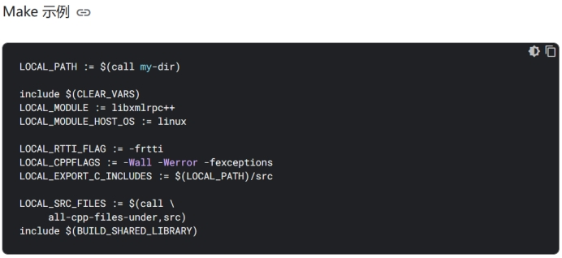  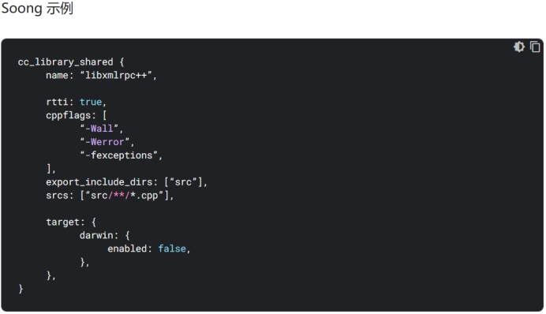 

&nbsp;

### **构建Android**

参考：[<ins>https://source.android.google.cn/docs/setup/build/building</ins>](https://source.android.google.cn/docs/setup/build/building)

设置环境(通过脚本导入命令)

. build/envsetup.sh

或

source build/envsetup.sh

通过hmm查看导入的命令

选择目标

lunch aosp_arm-eng

或

lunch

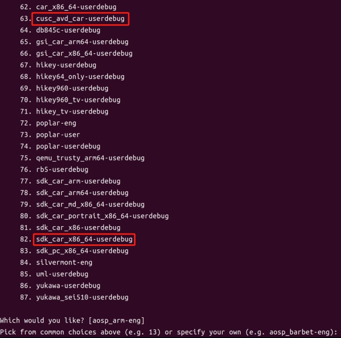 

通过菜单进行选择，菜单中的名称后缀解释如下：

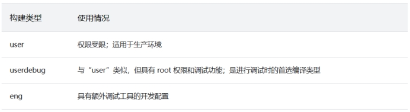 

可以选择的硬件设备参考：

[<ins>https://source.android.google.cn/docs/setup/build/running?hl=zh-cn#selecting-device-build</ins>](https://source.android.google.cn/docs/setup/build/running?hl=zh-cn#selecting-device-build)

&nbsp;

### **编译代码**

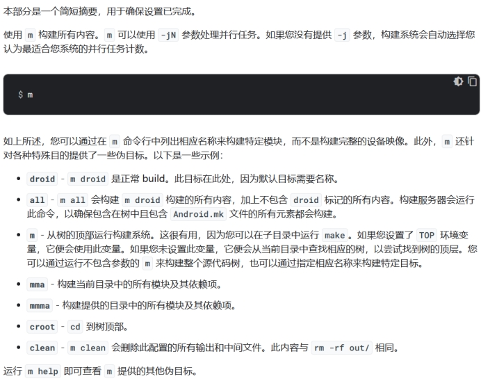 

### **模拟器启动**

emulator &

&nbsp;

### **build指纹**

如需跟踪和报告与特定 Android build 相关的问题，请一定要了解 build 指纹。build 指纹是能让人看懂的唯一字符串，其中包含向每个 build 发出的制造商信息。有关详情，请参阅 Android 兼容性定义文档 (CDD) 中 Build 参数部分内的“FINGERPRINT”说明。

[<ins>https://source.android.google.cn/docs/compatibility/14/android-14-cdd#322_build_parameters</ins>](https://source.android.google.cn/docs/compatibility/14/android-14-cdd#322_build_parameters)

&nbsp;

build指纹表示特定的 Android 实现和修订版本。此唯一键可让应用开发者和其他人报告与特定固件版本相关的问题。如需了解 Android 问题报告流程，请参阅报告 bug。

&nbsp;

build指纹封装了所有 Android 实现详情：

l API：Android 和原生，以及软 API 行为

l 核心 API 和部分系统界面行为

l CDD 中定义的兼容性和安全性要求

l 应用所采用的产品规范和 uses-feature 设置，用于定位符合预期要求的设备

l 硬件和软件组件的实现

&nbsp;

如需查看完整详情，请参阅 CDD。如需有关打造全新 Android 设备的说明，请参阅添加新设备。

### **编译内核**

设备内核+通用内核

参考：[<ins>https://source.android.google.cn/docs/setup/build/building-kernels</ins>](https://source.android.google.cn/docs/setup/build/building-kernels)

repo init -u https://android.googlesource.com/kernel/manifest -b BRANCH

以下是BRANCH可选的分支名称(最右边)

  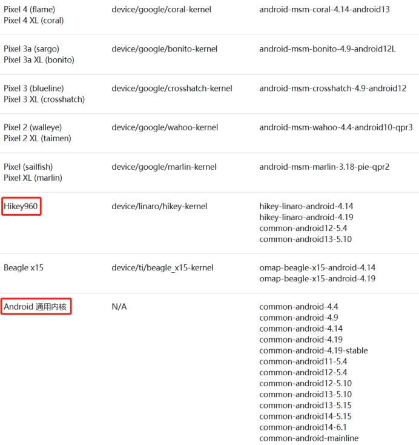 

###### **以下是构建方法**

Android 13之前

build/build.sh

Android 13及以后

tools/bazel build //common:kernel_aarch64_dist

tools/bazel run //common:kernel_aarch64_dist -- --dist_dir=$DIST_DIR

&nbsp;

###### **以下是一些Tips：**

1. Android 11 引入了 GKI，用于将内核拆分为由 Google 维护的内核映像和由供应商维护的模块，二者分别单独构建。

2. 在 Android 12 中，Cuttlefish 和 Goldfish 融合，因此它们共享同一个内核：virtual_device。

3. Android 13 引入了使用 Bazel (Kleaf) 构建内核的功能，以取代 build.sh。

&nbsp;

如需详细了解如何使用 Bazel 构建 Android 内核，请参阅：Kleaf - 使用 Bazel 构建 Android 内核。https://android.googlesource.com/kernel/build/+/refs/heads/master/kleaf/README.md

&nbsp;

###### **对设备和内核的 Kleaf 支持**

下表列出了对各个设备内核的 Kleaf 支持。对于未列出的设备，请与设备制造商联系。

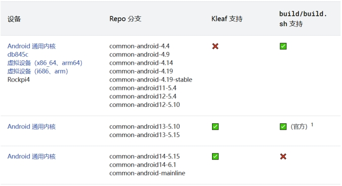  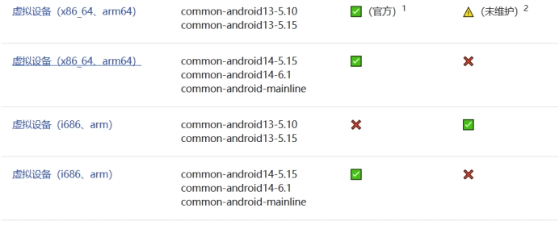 

&nbsp;

有关Android通用内核喝GKI解释，参考：

[<ins>https://source.android.google.cn/docs/core/architecture/kernel/android-common</ins>](https://source.android.google.cn/docs/core/architecture/kernel/android-common)

&nbsp;

###### **功能和启动内核**

每个 Android 平台版本都支持启动基于三个 Linux 内核版本中任意一个的新设备。如下表所示，Android 11 的启动内核为android-4.14-stable 、 android-4.19-stable和android11-5.4 。

由于更新平台版本时通常不需要升级内核，因此缺少平台版本最新功能的内核仍可用于启动设备。因此，即使将平台版本升级到 Android 11 后，专为 Android 10 设计的内核（例如android-4.19-q ）也可以在设备上使用。从 Android 12 开始，功能内核将少于启动内核，以限制功能内核的数量必须支持的稳定 KMI。

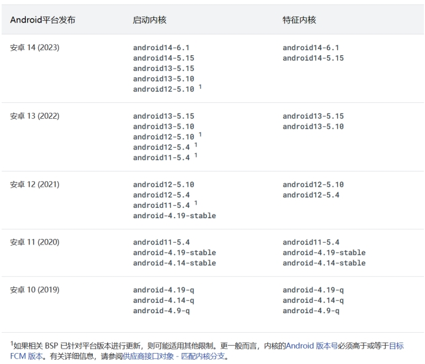 

&nbsp;

**有关Android操作系统核心主题，包括架构、内核、HAL层等开发文档，可以参考：**

[**<ins>https://source.android.google.cn/docs/core</ins>**](https://source.android.google.cn/docs/core)

&nbsp;

有关Android automotive的主题，可以参考：

[<ins>https://source.android.google.cn/docs/automotive</ins>](https://source.android.google.cn/docs/automotive)

Android 14 Automotive 远程唤醒工作流示例

[<ins>https://source.android.google.cn/docs/automotive/remote_access</ins>](https://source.android.google.cn/docs/automotive/remote_access)

## **Build LineageOS for** **Xiaomi Mi MIX 2S**

### **LineageOS介绍**

LineageOS（也称Lineage OS、Lineage OS Android Distribution）是一个面向智能手机和平板电脑的自由、免费、开放源代码的Android系统分支。它是深受欢迎的定制ROM CyanogenMod的继任者。它在2016年12月Cyanogen公司突然宣布停止开发并关闭项目基础设施后复刻而生。LineageOS于2016年12月24日正式启动，其源代码存放于GitHub。

&nbsp;

由于Cyanogen公司保留了使用Cyanogen名称的权利，因此项目复刻后更名为LineageOS。

&nbsp;

目前LineageOS最新版本是21，基于AOSP 14. 参考https://www.lineageos.org/Changelog-28/

&nbsp;

LineageOS的思路是，内核使用手机厂商或者SoC供应商提供的开源内核版本，或支持的二进制版本，系统源码使用AOSP，应用层自行开发的模式。所以源代码分为三个部分：

1. AOSP源码，谷歌OpenSource托管

2. LineageOS APP 源码，Github托管

3. Kernel源码或二进制模组，Github托管，或使用脚本从手机端直接拉取

&nbsp;

基于这个模式，LineageOS支持的设备是有限的，谷歌手机因为内核开源，所以全系列支持，其它手机厂根据不同机型支持的情况也不同，参见：[<ins>https://wiki.lineageos.org/devices/</ins>](https://wiki.lineageos.org/devices/)

&nbsp;

本次以小米 Mix 2s(代号Polaris)为例讲解

参考：[<ins>https://wiki.lineageos.org/devices/polaris/build/</ins>](https://wiki.lineageos.org/devices/polaris/build/)

&nbsp;

### **环境要求**

1. Mix 2s手机一台(可解锁)

2. 编译软硬件环境和AOSP要求差不多，按照之前AOSP的要求准备即可

3. 因为涉及到编译版本的刷机操作，所以需要准备platform-tools环境，可以安装Android Studio并配置SDK，也可以只下载platform-tools，地址[https://dl.google.com/android/repository/platform-tools-latest-linux.zip，下载后配置环境变量：](https://dl.google.com/android/repository/platform-tools-latest-linux.zip%EF%BC%8C%E4%B8%8B%E8%BD%BD%E5%90%8E%E9%85%8D%E7%BD%AE%E7%8E%AF%E5%A2%83%E5%8F%98%E9%87%8F%EF%BC%9A)

unzip platform-tools-latest-linux.zip -d ~

在~/.profile文件中添加以下代码：

\# add Android SDK platform tools to path

if \[ -d "$HOME/platform-tools" \] ; then

PATH="$HOME/platform-tools:$PATH"

fi

运行 source ~/.profile 导入环境变量配置

&nbsp;

4. 安装编译需要的库

sudo apt install bc bison build-essential ccache curl flex g++-multilib gcc-multilib git git-lfs gnupg gperf imagemagick lib32readline-dev lib32z1-dev libelf-dev liblz4-tool libsdl1.2-dev libssl-dev libxml2 libxml2-utils lzop pngcrush rsync schedtool squashfs-tools xsltproc zip zlib1g-dev

如果是低于Ubuntu 23.10，还需要安装lib32ncurses5-dev libncurses5 libncurses5-dev

5. Java要求，如果是LineageOS 18.1+版本，源码自带JDK，无需自行安装

6. 如果是LineageOS 17.1+，还需要安装Python 3 (sudo apt install python-is-python3)

&nbsp;

### **检出代码**

7. 创建安装目录

mkdir -p ~/bin

mkdir -p ~/android/lineage

8. 下载repo

curl https://storage.googleapis.com/git-repo-downloads/repo > ~/bin/repo

chmod a+x ~/bin/repo

在~/.profile中添加以下代码

\# set PATH so it includes user's private bin if it exists

if \[ -d "$HOME/bin" \] ; then

PATH="$HOME/bin:$PATH"

fi

运行 source ~/.profile 导入环境变量配置

&nbsp;

9. 配置git

git config --global user.email "you@example.com"

git config --global user.name "Your Name"

git lfs install

&nbsp;

10. 配置编译缓存(可选)

export USE_CCACHE=1

export CCACHE_EXEC=/usr/bin/ccache

ccache -o compression=true

&nbsp;

11. 初始化LineageOS 源代码仓库(以LineageOS 21为例)

cd ~/android/lineage

repo init -u https://github.com/LineageOS/android.git -b lineage-21.0 --git-lfs

repo sync

注意：由于LineageOS的源代码包含AOSP，所以在repo init之后，sync之前做一点修改

进入到源码根目录/.repo/manifests，打开default.xml，找到remote name="aosp"节点，修改fetch="https://mirrors.tuna.tsinghua.edu.cn/git/AOSP"，保存退出后再运行repo sync.

经过漫长的等待，就会下载完源代码。一定要保证github访问稳定，否则会导致代码不完整甚至下载中断，可通过多次运行repo sync来保证代码完整性

&nbsp;

12. 准备设备特殊代码

在源代码根目录运行以下命令

source build/envsetup.sh

breakfast polaris

这会下载mix 2s的特殊设备配置文件和内核

如果你的设备已经刷过LineageOS，可以使用设备获取这些文件。

进入~/android/lineage/device/xiaomi/polaris 目录，接上手机并开启adb调试模式，运行

./extract-files.sh

脚本会从手机上直接获取所需的配置文件和内核。

&nbsp;

### **编译代码**

13. 编译

运行

croot

brunch polaris

等待编译结束，时间与AOSP的编译时间相当

&nbsp;

### **刷机步骤**

14. 刷机

进入到out目录，找到两个文件

recovery.img // 这是LineageOS的recovery.

lineage-21.0-20240305-UNOFFICIAL-polaris.zip // 这是lineage的安装包

a) 解锁手机

b) 手机开启adb调试模式，adb -d reboot bootloader 进入到bootloader。也可以通过同时按住音量键下+电源键进入。进入到bootloader后使用fastboot devices查看设备是否识别

c) 刷入编译好的recovery：fastboot flash recovery recovery.img . 刷入后，不要直接重启进入到系统，而是按住音量上+电源键进入到recovery，如果不是LineageOS的图标，则需要重复b步骤后再次刷入recovery，这是因为Android目前使用A/B分区的方式保证升级的安全性，所以存在两个recovery分区，可能需要刷两次同时覆盖两个分区。

d) 进入到LineageOS后，三清，然后进入apply update from adb, 进入到sideload线刷模式

e) 在电脑端输入adb -d sideload lineage-21.0-20240305-UNOFFICIAL-polaris.zip ，等待100%后刷入成功，重启进入系统。系统刷完

f) 如果要刷入GMS，则在e步骤刷完zip后继续刷入其它GMS包，然后再重启即可。

&nbsp;

&nbsp;

## **Android Input子系统参考文章**

&nbsp;

Android Input子系统-含实例源码

[<ins>https://www.cnblogs.com/weiqifa/p/9604149.html</ins>](https://www.cnblogs.com/weiqifa/p/9604149.html)

&nbsp;

input子系统——kernel中input设备介绍

[<ins>https://blog.csdn.net/u013604527/article/details/53432623/</ins>](https://blog.csdn.net/u013604527/article/details/53432623/)

&nbsp;

android 物理按键

[<ins>https://blog.csdn.net/xubin341719/article/details/7881735</ins>](https://blog.csdn.net/xubin341719/article/details/7881735)

&nbsp;

&nbsp;

## **Android UpdateEngine子系统参考资料**

OTA 更新概览

[<ins>https://source.android.google.cn/docs/core/ota?hl=zh-cn</ins>](https://source.android.google.cn/docs/core/ota?hl=zh-cn)

&nbsp;

LineageOS Updater APP

[<ins>https://github.com/LineageOS/android_packages_apps_Updater</ins>](https://github.com/LineageOS/android_packages_apps_Updater)

&nbsp;